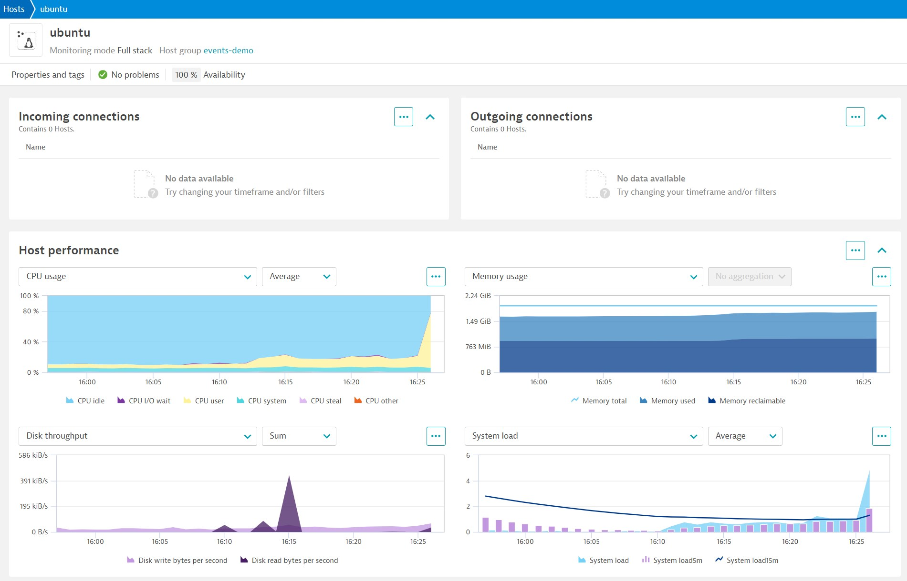

# Set Dynatrace Details
Gather your Dynatrace details:

- Your Dynatrace environment in the form: `https://abc12345.live.dynatrace.com` (remove the trailing slash)
- Create API tokens with the correct permissions (see below)

## Create API Tokens
You need to create two API tokens. The first will provide permissions to download and install a OneAgent. The second will provide permissions to ingest (send) events to the Dynatrace API.

In Dynatrace, select the `Access tokens` menu option.

Create a token using the `PaaS` template.
Create a second token with `Ingest events` permissions (search for the scope `events.ingest`).

For additional security, (optional) set the expiration date for tomorrow. The tokens will automatically invalidate.

## Install OneAgent
Click the following box to save your details.

> Hint: `Ctrl + Shift + V` works well.

```
source ./setDetails.sh
```{{exec}}

When you are happy that everything looks OK, click the following box to install the Dynatrace OneAgent.

```
./installOneAgent.sh
```{{exec}}

Navigate to the `Hosts` screen in Dynatrace and open your host page.

