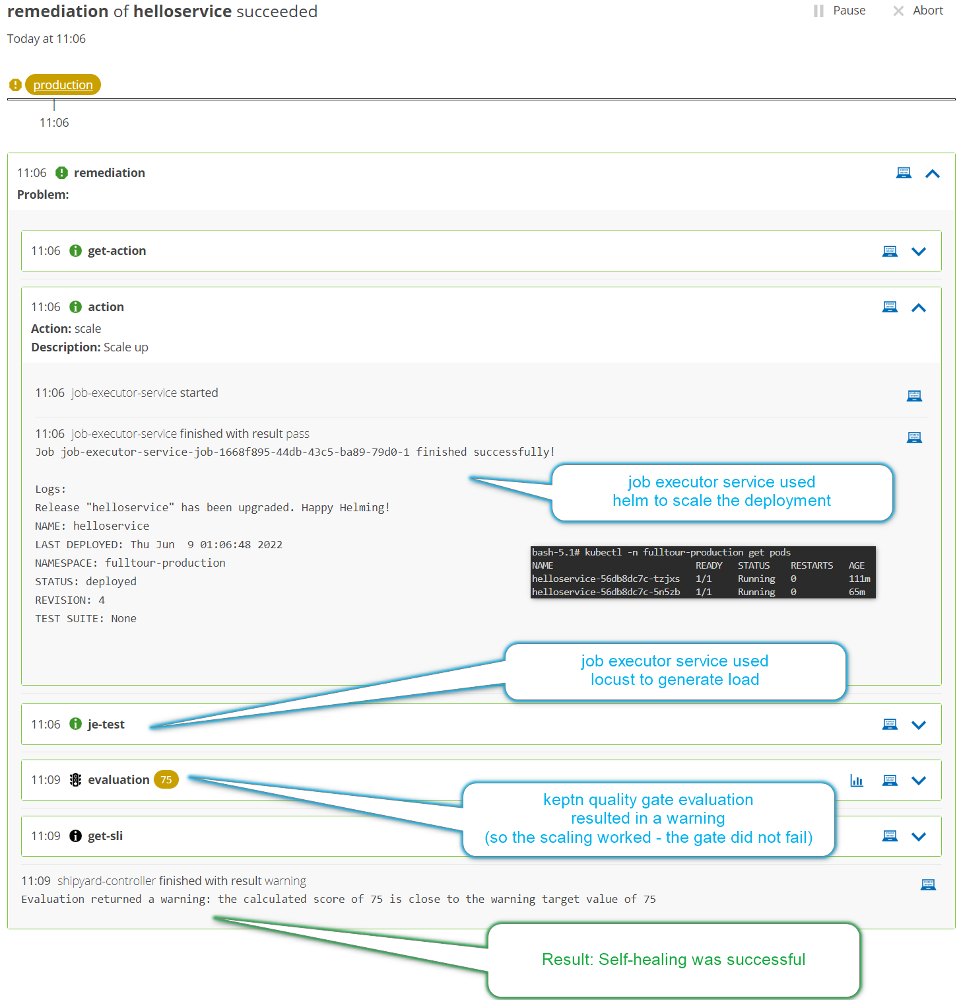

> ⚠️ Keptn v1 (the product used in this tutorial) is now End of Life.
> We suggest immediately migrating to [Keptn.](https://keptn.sh/latest/)
> More information on this decision is [here.](https://medium.com/keptn/keptn-lifecycle-toolkit-is-now-keptn-e0812217bf46)
> This tutorial is no longer maintained ⚠️

So far, a fairly robust delivery pipeline has been built. Optional manual approval steps have been added, automated quality gates were then added to automate and improve on the previous manual approval.
Finally, release validation was added to run quality evaluations **after** a production release and ensure quality software **in** production.

This step adds the ability to Keptn to self-heal your application based on problems sent to Keptn.

## Check Current Pod Counts

Both `qa` and `production` should have 1 pod running. Validate this now:

```
kubectl -n fulltour-qa get pods
kubectl -n fulltour-production get pods
```{{exec}}

## Setup Problem Definition and Remediation Action

Run this script which:

1. Tells Keptn to expect incoming problems of a certain type
2. Tells Keptn what to attempt in such scenarios (eg. scale)
3. Tells Job executor service to respond to these scaling requests
4. Tells Job executor service that Helm should upgrade the deployment with the new replica count (2 pods not 1)
5. Creates a dummy problem which we can use to repeatedly trigger this scenario

After the scaling has occurred:
1. Load is generated on the service (this step would probably not be necessary in a real production environment)
2. A further quality evaluation is executed - did scaling the pods actually help?

> Note: The demo image doesn't actually have a problem pattern that resolves with scaling. So **expect** the quality gate to still provide a pass. Scaling the pods **will** be successful.
> 
```
~/self_healing.sh
```{{exec}}


## 🚩 Trigger a Problem

In reality you would expect alerts from Prometheus alert manager or any external tool capable of informing Keptn of problems.

For the speed of the demo though, we will use a dummy problem. Send Keptn the problem event and watch Keptn scale the pods:

```
keptn send event -f ~/self_healing/remediation_trigger.json
```{{exec}}

When the sequence is complete, you should see:


  
## Check Pod Counts Again

`qa` environment should still have 1 pod running. `production` environment should have scaled up to 2 pods.

```
kubectl -n fulltour-qa get pods
kubectl -n fulltour-production get pods
```{{exec}}
  
```
$ kubectl get pods -n fulltour-qa
NAME                           READY   STATUS    RESTARTS   AGE
helloservice-56db8dc7c-mvqxx   1/1     Running   0          17m

$ kubectl get pods -n fulltour-production
NAME                           READY   STATUS    RESTARTS   AGE
helloservice-56db8dc7c-6bvf4   1/1     Running   0          14m
helloservice-56db8dc7c-2wp4s   1/1     Running   0          67s
```
