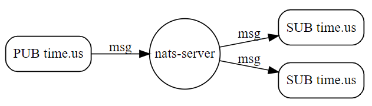

## Subject Based Messaging

Fundamentally, NATS is about publishing and listening for messages. Both of these depend heavily on Subjects.

## What is a Subject?
At its simplest, a subject is just a string of characters that form a name which the publisher and subscriber can use to find each other. It helps scope messages into streams or topics.



A lot more information is available in the [official documentation](https://docs.nats.io/nats-concepts/subjects).

## Enough Reading - Test It Out!

Enough reading, it is time to test out NATS.

First, connect to the `nats-box` (this is a handy wrapper useful for quick demos). `nats-box` comes preconfigured with the CLI tools you need.

```
kubectl exec -n nats -it deployment/my-nats-box -- /bin/sh -l
```{{exec}}

Now simulate a subscriber and subscribe to the `test` subject:

```
nats sub test
```{{exec}}

You should see output similar to this:

```
06:43:36 Subscribing on test
```{{}}

Open a new terminal window by clicking the <kbd>+</kbd> button. Connect again to the `nats-box` and publish a message to the `test` subject:

```
kubectl exec -n nats -it deployment/my-nats-box -- /bin/sh -l
nats pub test "hello world"
```{{exec}}

You should see:

```
06:44:48 Published 11 bytes to "test"
```{{}}

Flick back to Tab 1 and you should see output similar to this:

```
[#1] Received on "test"
hello world
```{{}}

## Bonus: Experiment with Subjects

NATS recommends building subjects using dot separators eg: `io.nats.cities` or `io.nats.countries` and keeping the number of tokens to less than 16.

A subject "exists" as soon as it has a subscriber (there is no implicit "create subject" command).

Open a new terminal, connect to `nats-box` and subscribe to a new subject, for example: `names.dog`:

```
kubectl exec -n nats -it deployment/my-nats-box -- /bin/sh -l
nats sub names.dog
```{{exec}}

Open another new terminal and subscribe to a different subject called: `names.cat`:

```
kubectl exec -n nats -it deployment/my-nats-box -- /bin/sh -l
nats sub names.cat
```{{exec}}

Change back to Tab 1 (the terminal subscribing to the `test` subject) and press `ctrl + c` to stop listening on `test`.

Now publish a dog name to `names.dog`:
```
nats pub names.dog Lassie
```{{exec interrupt}}

You should see:

```
# nats pub names.dog Lassie
07:12:04 Published 6 bytes to "names.dog"
```{{}}

and in the Tab 3 (the window subscribing to `names.dog`) you should see:

```
[#1] Received on "names.dog"
Lassie
```{{}}