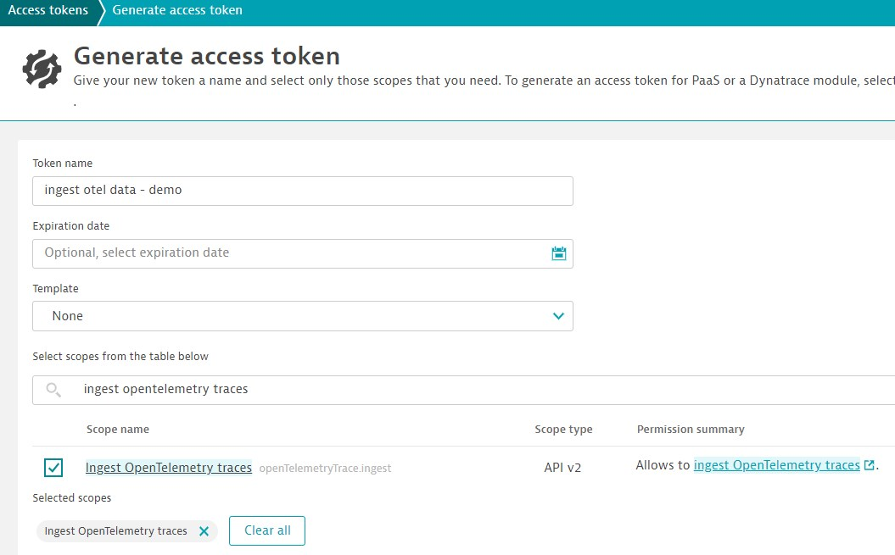

# Preparation

Please login to Dynatrace and go to `Access Tokens`{{}}.

Create a token with `openTelemetryTrace.ingest` scope.



Click this to set your details:

```
. ./setDTDetails.sh
```{{exec}}

When you are happy, click the following. This will modify the Collector `config.yaml` to point to your Dynatrace environment.

```
./updateCollectorConfig.sh
```{{exec}}

> Made a mistake? Just modify `config.yaml` to ensure the Dynatrace URL and API token are correct.