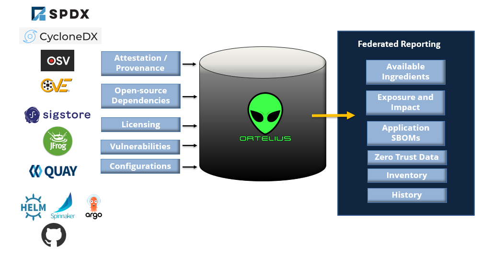

# Welcome to Ortelius.

Ortelius is a unified 'evidence store' of supply chain data designed to simplify a decoupled microservices environment. Ortelius builds relationships between service (package) and consuming 'logical' applications.

With Ortelius, open-source and API developers can register their services and track their consumers. Enterprise developers register their 'logical' application's base version and are notified when a dependency change causes the creation of a new application version, new SBOM, CVE, and dependency map. By centralizing and tracking detailed supply chain data, Ortelius provides the enterprise open-source consumers and open-source developers a coordinated view of who is using a service, its version, and inventory across all end-points.

We are creating a central store for development teams to define provenance, apply zero-trust policies, and eventually score risk factors of both internal common code and open-source packages.

In other words, we answer the question, "who is using Log4j."

For more information, see the comprehensive documentation at [Ortelius' documentation](http://docs.ortelius.io/).

## Please Be Patient

Wait here until you see `🎉 Installation Complete 🎉` on the right. Then click Start.