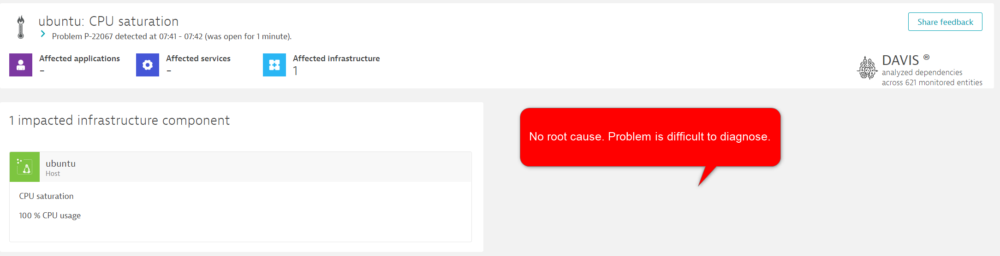

Please run your production release now...

```
ansible-playbook ~/playbooks/production-release.yaml
```{{exec}}

## What Happens?

This playbook runs a process which, after a few moments, causes a problem in Dynatrace. However the problem does not have a root cause and is hard to analyse.

*Hint: Run `top` to see Ansible is doing*

When you see the Dynatrace problem press `Ctrl + C` to end the playbook.

