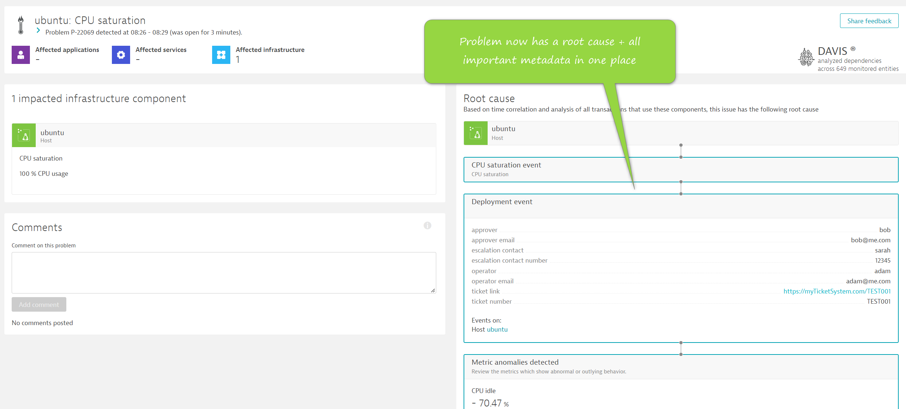

Dynatrace has no additional knowledge or context of this issue. It knows (and detects) that the `stress` tool was hogging the CPU but it doesn't know:

1. That a deployment caused this
2. Who actioned this deployment
3. Who authorised this deployment
4. Who or how to escalate this issue

In short, Dynatrace doesn't know any of the human factors that we know. This knowledge probably does exist and can be retrieved from other systems.

## Close the Previous Problem
If the existing problem record is open, please manually close it now.

## Run Improved Deployment Workflow

```
ansible-playbook ~/playbooks/improved-production-release.yaml
```{{exec}}

## What Happens?

The improved process requests some metadata about this release process. In the real world this would be automatically pulled from third party systems of record.

The playbook sends an event to Dynatrace and attaches to the tagged host.

The playbook runs the `stress` tool again, identically to before.

This time, the problem record **has a root cause**.

When you see the Dynatrace problem press `Ctrl + C` to end the playbook.


