# Pyrsia - The Decentralized Package Network

## What Is Pyrsia?

Pyrsia is a network of two types of interconnected nodes:

- Build nodes that build open source libraries from source
- Regular nodes that form the entry point to the network for build tools

On top of this, both type of nodes participate in the peer-to-peer distribution of artifacts.


arch


v0.0.3


The result is a high-available peer-to-peer network of trusted open source build artifacts that no single entity can control.

## Why do I need Pyrsia?

As a developer relying on open source libraries, you greatly depend on:

- The entity performing a build of the open source library
- A central repository of build artifacts

This poses several risks:

- There is no way for you to verify the binary artifact is in fact the result of the given source so one malicious entity with publication access to a central repository can publish anything it wants.
- A central repository is controlled by a single entity, which could take decisions you do not agree with.

There is a solution to this problem: build all the open source libraries you depend on yourself and publish them in a private local repository.

But why not use Pyrsia and work together instead?

## How does Pyrsia work?
Pyrsia works by designating a number of independent build nodes.


Those build nodes perform builds for all kinds of open source libraries (at this stage, Pyrsia is building support for Docker images and Maven artifacts, but more package types will be added soon). The trust in the built artifacts is reached because no single build node can publish an artifact on its own. It needs to ask all the other build nodes to verify the build (i.e. perform the same build and compare the result) and only when an absolute majority verified the build (also known as 'consensus' is reached), the artifact is published.

Pyrsia keeps a transparency log of those publications and distributes those in a blockchain.

Any other node in the network can access these logs and use them to verify binary artifacts that are downloaded from other nodes in the network. Whenever a node downloads an artifact, it can choose to participate in the content distribution and provide this artifact to other nodes itself.



## While You've Been Reading

While you were reading, we were busy installing Pyrsia. If you see the following text, you can now proceed.

```
🎉 Installation Complete 🎉
Please proceed...
```