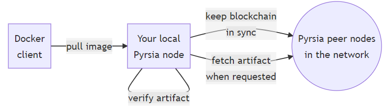
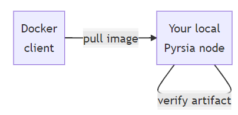

## Verify that Pyrsia is Running

```
pyrsia ping
```{{exec}}

You should see:

```
Connection Successful !!
```{{}}

## Configure Docker to Use Pyrsia

> Note: On Linux, this is configured automatically during install and has already been done for this demo environment. The instructions below are for your information only. See [here](https://pyrsia.io/docs/tutorials/docker/#configure-docker) for more.

Verify that docker uses Pyrsia:

```
cat /etc/docker/daemon.json
```{{exec}}

The `registry-mirrors` array should be:

```
"registry-mirrors": [
    "http://localhost:7888"
  ]
```{{}}

## Pull a Docker Image

We'll use `alpine:3.16.2` as an example. Your Docker installation is now configured to use your local Pyrsia node to retrieve artifacts. When you start Pyrsia, it will make sure it has the most recent copy of the blockchain, which contains all the publication logs, also known as transparency logs.

When your Docker client pulls an image, it will make the request to your local Pyrsia node (because you configured it as a registry mirror) and it will fetch the artifact from a peer node in the Pyrsia network, verify it based on the transparency logs and return it to the Docker client.



Let's try this, but first make sure Alpine is not yet in your local Docker cache:

```
docker rmi alpine:3.16.2
```{{exec}}

Then pull the image:

```
docker pull alpine:3.16.2
```{{exec}}

Congratulations! The alpine Docker image was now retrieved from the Pyrsia network. You can verify this in the Pyrsia logs. On Linux you will find the logs in `/var/log/syslog`. On Windows you can see the logs in the command prompt you used to run the Pyrsia node.

Take a look for the relevant line in `/var/log/syslog`:

```
cat /var/log/syslog | grep -e "pyrsia::docker::v2::handlers::manifests" -e "pyrsia::artifact_service::storage"
```{{exec}}

You will see something like this:

```
DEBUG pyrsia::docker::v2::handlers::manifests > Fetching manifest for alpine with tag: 3.16
INFO  pyrsia::artifact_service::storage       > An artifact is being pulled from the artifact manager b0ed9f25-f322-47ef-8dac-03154209cfcf
```{{}}


> Note: On macOS or Windows, you can also see the Pyrsia logs, but it depends on your specific installation where to find them. (See [Installation tutorial](https://pyrsia.io/docs/tutorials/quick-installation/))

## Local Cache

If you would repeat these steps, your local Pyrsia node will already have a copy of the requested artifact, so it won't be retrieved again:



This local cache is also used by your Pyrsia node to participate in the artifact distribution to other nodes.