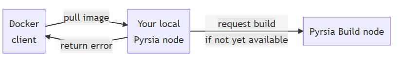

## Request a Build

While it's Pyrsia intention to build and publish all official Docker images, there is a possibility that a Docker image is not yet built /available.

When you pull an image that is unknown, your local Pyrsia node will send a build request to one of the authorized build nodes, which schedules a build for the given Docker image.



Your Docker client will receive an error from Pyrsia at that point (your local Docker client might fall back to Docker Hub), but when the build is finished and the other build nodes inside the Pyrsia network reached consensus, your node will receive updated transparency logs via the blockchain and you will be able to pull the image from the Pyrsia network.

To find out if an image is available, use the inspect-log described above.

Alternatively, you can also explicitly request the build of a new Docker image:

```
pyrsia build docker --image alpine:3.16.3
```{{exec}}

This will send the build request to one of the authorized build nodes, which will start a build. When consensus about that build is reached, it will be available in the transparency logs and can be retrieved by all nodes in the network.

Read more about [Pyrsia Authority Nodes](https://pyrsia.io/blog/2023/01/05/authority_nodes) and [why Pyrsia uses a blockchain and how a blockchain does not equal cryptocurrency / gas / fees](https://pyrsia.io/blog/2022/10/10/why-does-pyrsia-use-a-blockchain).