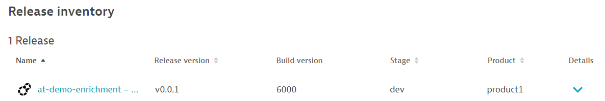

## Tracking Releases

### Install Apache:

```
ansible-playbook ~/playbooks/install-apache.yaml
```{{exec}}

## View Apache

Apache is now running on port 80 ([click here to view]({{TRAFFIC_HOST1_80}}))

## Adding Environment Variables

The [Dynatrace documentation](https://www.dynatrace.com/support/help/how-to-use-dynatrace/cloud-automation/release-monitoring/version-detection-strategies) lists 4 environment variables you can use to track software versions.

1. `DT_RELEASE_VERSION` for Version
2. `DT_RELEASE_STAGE` for Stage
3. `DT_RELEASE_PRODUCT` for Product
4. `DT_RELEASE_BUILD_VERSION` for Build version

The target software will have different places you need to place these environment variables. There is no one-size-fits-all here. Work with your customer (or Google) to find out where these variables need to go.

For `apache2` the file you need to modify is `/etc/apache2/envvars`

Execute this snippet to add the following block at the end of the `/etc/apache2/envvars` file:

```
cat <<EOF >> /etc/apache2/envvars
export DT_RELEASE_VERSION=v0.0.1
export DT_RELEASE_STAGE=dev
export DT_RELEASE_PRODUCT=product1
export DT_RELEASE_BUILD_VERSION=6000
EOF
```{{exec}}

## (optional) View envvars File

```
cat /etc/apache2/envvars
```{{exec}}

## Restart Apache

```
ansible-playbook ~/playbooks/restart-apache.yaml
```{{exec}}

## View in Dynatrace

After a few minutes the releases screen in Dynatrace should be populated with your release information.

