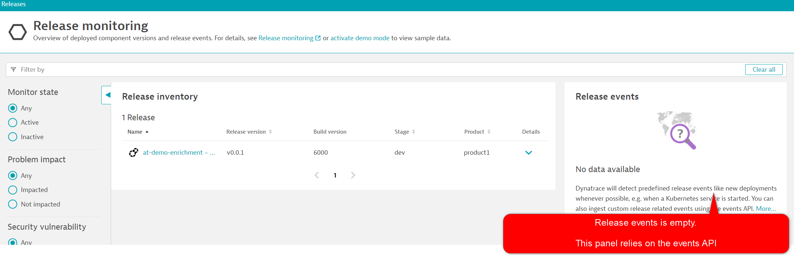

## Release Events Empty?



Notice that the release events panel is empty. This panel relies on the events API.

Best Practice: Use **both** environment variables AND the events API for full coverage.

## Use Events API and Environment Variables

```
ansible-playbook ~/playbooks/enhanced-release.yaml
```{{exec}}

## Notes and Gotchas

1) Dynatrace tracks releases based on PGI metadata. Tags and events need to be attached to the PGI to work.

Setting the envvars should automatically create PGI tags like `[Environment]DT_RELEASE_STAGE: dev`. If you do not see these, the env vars haven't taken (you've probably put them in the wrong place).

2) Don't just push events to PGIs tagged with a host group - the deployment will register against every PGI on that host.