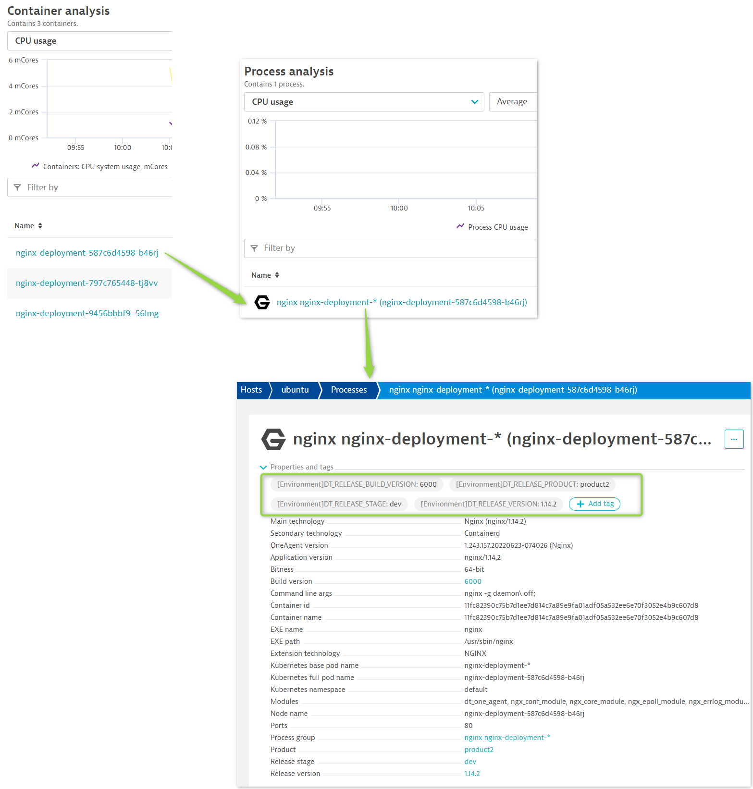
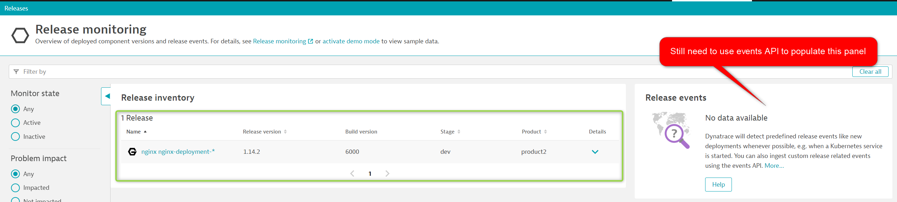

# Track Deployments in Dynatrace

Modify the deployment [following the Dynatrace documentation](https://www.dynatrace.com/support/help/how-to-use-dynatrace/cloud-automation/release-monitoring/version-detection-strategies#kubernetes).

Add labels to the deployment:

1. `app.kubernetes.io/version` tracks the version (equivalent to `DT_RELEASE_VERSION` environment variable).
2. `app.kubernetes.io/part-of` tracks the product (equivalent to `DT_RELEASE_PRODUCT` environment variable).
3. `dynatrace-release-stage` tracks the stage (equivalent to `DT_RELEASE_STAGE` environment variable).

Clicking the following code block will make these changes for you and re-deploy Nginx.

```
cat << EOF > ~/upgrade_nginx.yaml
---
apiVersion: apps/v1
kind: Deployment
metadata:
  name: nginx-deployment
  labels:
    app: nginx
spec:
  replicas: 1
  selector:
    matchLabels:
      app: nginx
  template:
    metadata:
      labels:
        app: nginx
        app.kubernetes.io/version: "1.14.2"
        app.kubernetes.io/part-of: "product2"
        dynatrace-release-stage: "dev"
        dynatrace-build-version: "6000"
    spec:
      containers:
      - name: nginx
        image: nginx:1.14.2
        ports:
        - containerPort: 80
        env:
        - name: DT_RELEASE_VERSION
          value: "1.14.2"
        - name: DT_RELEASE_PRODUCT
          value: "product2"
        - name: DT_RELEASE_STAGE
          value: "dev"
        - name: DT_RELEASE_BUILD_VERSION
          value: "6000"
---
apiVersion: v1
kind: Service
metadata:
  name: nginx-service
spec:
  type: LoadBalancer
  selector:
    app: nginx
  ports:
    - protocol: TCP
      port: 80
      targetPort: 80
EOF
kubectl apply -f ~/upgrade_nginx.yaml
```{{exec}}

## Validate Deployment has Labels

`kubectl describe pod -l app=nginx`{{exec}} should show:

```
...
Labels:       app=nginx
              app.kubernetes.io/part-of=product2
              app.kubernetes.io/version=1.14.2
              dynatrace-release-stage=dev
Environment:
  DT_RELEASE_VERSION:  1.14.2
  DT_RELEASE_PRODUCT:  product2
  DT_RELEASE_STAGE:    dev
  DT_RELEASE_BUILD_VERSION: 6000
...
```

## Wait for new pod ID to Show in Dynatrace

When the pod is showing on the host screen, drilldown to the PGI screen and notice it is correctly tagged with the `DT_RELEASE_*` metadata.



Navigate to the releases screen and see that the release is tracked properly.

Again, the above method only uses the environment variables. As previously described, best practice suggests to use **both** environment variables and API for a holistic view.




## Notes

In a real environment:

1) The environment variables would not be adjusted manually. The pipeline would pull these details from Git and make these changes automatically.
2) The API calls would be performed automatically by pipeline or release tooling.


## Exercise: Create Ansible script for a Robust Production Release Process

Use the sample Ansible playbooks in `~/playbooks` as a starting point.

Craft a release process that:

1. Applies environment variables dynamically
2. Leverages both environment variables and the Dynatrace API